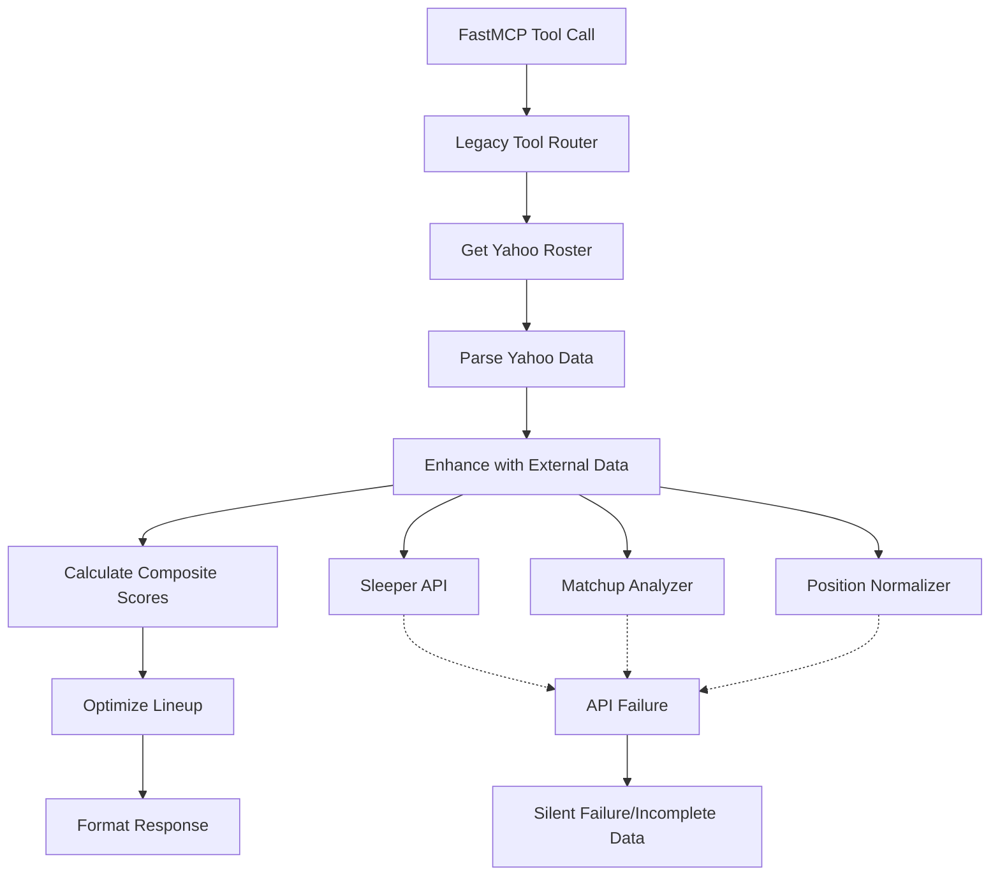

# Fantasy Football MCP Server - Lineup Optimization Tool Fix

## Overview

The MCP server's `ff_get_optimal_lineup` tool is experiencing functionality issues that prevent it from returning optimal lineup recommendations. After analyzing the codebase, several critical problems have been identified in the lineup optimization pipeline that need to be addressed to restore proper functionality.

## Problem Analysis

### Root Cause Issues

1. **Import and Module Dependency Failures**
   - Missing or broken imports for `sleeper_client`, `matchup_analyzer`, and `position_normalizer` instances
   - Circular dependency issues between modules
   - Inconsistent module initialization

2. **Data Flow Pipeline Breaks**
   - Yahoo roster parsing returns incomplete Player objects
   - External data enhancement fails due to missing API client instances
   - Optimization engine receives insufficient player data

3. **Error Handling Gaps**
   - Silent failures in data fetching prevent error visibility
   - Missing fallback mechanisms for external API failures
   - Inadequate validation of player data completeness

## Architecture Analysis

### Current Data Flow


### Integration Issues
- **Module Instance Access**: References to `sleeper_client`, `matchup_analyzer`, `position_normalizer` are not properly initialized
- **Yahoo Data Structure**: Complex nested JSON parsing is fragile and fails on variations
- **External API Dependencies**: Heavy reliance on external services without proper fallbacks

## Solution Design

### 1. Module Initialization and Dependency Management

**Problem**: Global instances are not properly exported or initialized
**Solution**: Create proper module initialization with lazy loading

```python
# sleeper_api.py - Fix exports
sleeper_client = SleeperAPI()

# lineup_optimizer.py - Fix imports  
from sleeper_api import sleeper_client
from matchup_analyzer import MatchupAnalyzer
from position_normalizer import PositionNormalizer

class LineupOptimizer:
    def __init__(self):
        self.matchup_analyzer = MatchupAnalyzer()
        self.position_normalizer = PositionNormalizer()
```

### 2. Robust Yahoo Data Parsing

**Problem**: Yahoo roster parsing is fragile and fails on data structure variations
**Solution**: Implement defensive parsing with multiple fallback strategies

**Enhanced Parser Strategy**:
- Multiple JSON structure traversal paths
- Graceful degradation when fields are missing
- Default value assignment for required fields
- Validation of parsed player objects

### 3. External Data Enhancement Reliability

**Problem**: External API failures cause silent failures in lineup optimization
**Solution**: Implement fallback mechanisms and error tolerance

**Fallback Strategy**:
- Cache external data with longer TTL
- Use historical averages when APIs fail
- Provide default values for missing projections
- Log but don't fail on external API errors

### 4. Error Visibility and Debugging

**Problem**: Silent failures hide the root cause of optimization failures
**Solution**: Comprehensive error handling and logging

**Enhanced Error Handling**:
- Structured error responses with specific failure reasons
- Detailed logging for each pipeline stage
- Graceful degradation modes
- User-friendly error messages

## Implementation Strategy

### Phase 1: Fix Module Dependencies
1. Audit all imports and ensure proper module exports
2. Fix circular dependencies
3. Implement lazy initialization for external API clients
4. Add module-level error handling

### Phase 2: Strengthen Data Pipeline
1. Rewrite Yahoo roster parser with defensive programming
2. Add data validation at each pipeline stage
3. Implement fallback data sources
4. Add comprehensive unit tests for data parsing

### Phase 3: Enhance External API Resilience
1. Add proper error handling for Sleeper API calls
2. Implement caching strategies for external data
3. Create mock data fallbacks for development/testing
4. Add retry mechanisms with exponential backoff

### Phase 4: Improve Error Reporting
1. Replace silent failures with structured error responses
2. Add detailed logging throughout the pipeline
3. Implement health checks for external dependencies
4. Create debugging tools for data flow visibility

## Data Models and Validation

### Enhanced Player Data Model
```python
@dataclass
class Player:
    name: str
    position: str
    team: str
    opponent: str = ""
    yahoo_projection: float = 0.0
    sleeper_projection: float = 0.0
    matchup_score: int = 50  # Default neutral
    matchup_description: str = "Unknown matchup"
    trending_score: int = 0
    composite_score: float = 0.0
    is_starter: bool = False
    roster_position: str = ""
    player_tier: str = "unknown"
    
    def is_valid(self) -> bool:
        """Validate player has minimum required data."""
        return all([
            self.name.strip(),
            self.position in ['QB', 'RB', 'WR', 'TE', 'K', 'DEF'],
            self.team.strip()
        ])
```

### Optimization Response Schema
```python
@dataclass
class OptimizationResult:
    status: str  # "success" | "partial" | "error"
    optimal_lineup: Dict[str, Dict]
    bench: List[Dict]
    recommendations: List[str]
    analysis: Dict[str, Any]
    errors: List[str] = None  # Track any issues
    data_quality: Dict[str, int] = None  # Data completeness metrics
```

## Testing Strategy

### Unit Testing Focus
- **Parser Resilience**: Test Yahoo data parsing with various JSON structures
- **External API Mocking**: Mock Sleeper API responses for consistent testing  
- **Error Scenarios**: Test failure modes and fallback behaviors
- **Data Validation**: Ensure Player objects meet minimum requirements

### Integration Testing
- **End-to-End Pipeline**: Full workflow from Yahoo roster to optimized lineup
- **External API Failures**: Test behavior when external services are unavailable
- **Data Quality Scenarios**: Test with incomplete or malformed data
- **Performance Testing**: Ensure reasonable response times

## Migration and Deployment

### Backward Compatibility
- Maintain existing MCP tool interface
- Preserve current response format structure
- Add new fields without breaking existing clients
- Graceful degradation for missing features

### Deployment Strategy
1. **Phase 1**: Fix critical import and parsing issues
2. **Phase 2**: Deploy enhanced error handling and logging
3. **Phase 3**: Add fallback mechanisms and resilience features
4. **Phase 4**: Performance optimizations and monitoring

### Monitoring and Observability
- **Success Rate Metrics**: Track optimization success vs failure rates
- **Data Quality Metrics**: Monitor external API availability and data completeness
- **Performance Metrics**: Response times for optimization requests
- **Error Categorization**: Track types of failures for continuous improvement

## Risk Assessment

### High Risk Areas
- **External API Dependency**: Sleeper API availability affects functionality
- **Yahoo Data Format Changes**: Yahoo may change their JSON response structure
- **Performance Impact**: Enhanced error handling may increase response times

### Mitigation Strategies
- **Caching**: Implement aggressive caching for external data
- **Fallback Data**: Maintain historical averages for projections
- **Circuit Breaker**: Fail fast on repeated external API failures
- **Monitoring**: Real-time alerting on optimization failure rates

## Success Criteria

### Primary Objectives
1. **Reliability**: 95%+ success rate for lineup optimization requests
2. **Data Quality**: 90%+ of players have complete projection data
3. **Performance**: Sub-3-second response times for optimization
4. **Error Visibility**: All failures provide actionable error information

### Secondary Objectives
1. **External API Resilience**: Function with 50%+ external API availability
2. **Data Freshness**: Cache external data with appropriate TTL
3. **User Experience**: Clear recommendations and analysis
4. **Maintainability**: Comprehensive test coverage and documentation
1. **Import and Module Dependency Failures**
   - Missing or broken imports for `sleeper_client`, `matchup_analyzer`, and `position_normalizer` instances
   - Circular dependency issues between modules
   - Inconsistent module initialization

2. **Data Flow Pipeline Breaks**
   - Yahoo roster parsing returns incomplete Player objects
   - External data enhancement fails due to missing API client instances
   - Optimization engine receives insufficient player data

3. **Error Handling Gaps**
   - Silent failures in data fetching prevent error visibility
   - Missing fallback mechanisms for external API failures
   - Inadequate validation of player data completeness

## Architecture Analysis

### Current Data Flow


### Integration Issues
- **Module Instance Access**: References to `sleeper_client`, `matchup_analyzer`, `position_normalizer` are not properly initialized
- **Yahoo Data Structure**: Complex nested JSON parsing is fragile and fails on variations
- **External API Dependencies**: Heavy reliance on external services without proper fallbacks

## Solution Design

### 1. Module Initialization and Dependency Management

**Problem**: Global instances are not properly exported or initialized
**Solution**: Create proper module initialization with lazy loading

```python
# sleeper_api.py - Fix exports
sleeper_client = SleeperAPI()

# lineup_optimizer.py - Fix imports  
from sleeper_api import sleeper_client
from matchup_analyzer import MatchupAnalyzer
from position_normalizer import PositionNormalizer

class LineupOptimizer:
    def __init__(self):
        self.matchup_analyzer = MatchupAnalyzer()
        self.position_normalizer = PositionNormalizer()
```

### 2. Robust Yahoo Data Parsing

**Problem**: Yahoo roster parsing is fragile and fails on data structure variations
**Solution**: Implement defensive parsing with multiple fallback strategies

**Enhanced Parser Strategy**:
- Multiple JSON structure traversal paths
- Graceful degradation when fields are missing
- Default value assignment for required fields
- Validation of parsed player objects

### 3. External Data Enhancement Reliability

**Problem**: External API failures cause silent failures in lineup optimization
**Solution**: Implement fallback mechanisms and error tolerance

**Fallback Strategy**:
- Cache external data with longer TTL
- Use historical averages when APIs fail
- Provide default values for missing projections
- Log but don't fail on external API errors

### 4. Error Visibility and Debugging

**Problem**: Silent failures hide the root cause of optimization failures
**Solution**: Comprehensive error handling and logging

**Enhanced Error Handling**:
- Structured error responses with specific failure reasons
- Detailed logging for each pipeline stage
- Graceful degradation modes
- User-friendly error messages

## Implementation Strategy

### Phase 1: Fix Module Dependencies
1. Audit all imports and ensure proper module exports
2. Fix circular dependencies
3. Implement lazy initialization for external API clients
4. Add module-level error handling

### Phase 2: Strengthen Data Pipeline
1. Rewrite Yahoo roster parser with defensive programming
2. Add data validation at each pipeline stage
3. Implement fallback data sources
4. Add comprehensive unit tests for data parsing

### Phase 3: Enhance External API Resilience
1. Add proper error handling for Sleeper API calls
2. Implement caching strategies for external data
3. Create mock data fallbacks for development/testing
4. Add retry mechanisms with exponential backoff

### Phase 4: Improve Error Reporting
1. Replace silent failures with structured error responses
2. Add detailed logging throughout the pipeline
3. Implement health checks for external dependencies
4. Create debugging tools for data flow visibility

## Data Models and Validation

### Enhanced Player Data Model
```python
@dataclass
class Player:
    name: str
    position: str
    team: str
    opponent: str = ""
    yahoo_projection: float = 0.0
    sleeper_projection: float = 0.0
    matchup_score: int = 50  # Default neutral
    matchup_description: str = "Unknown matchup"
    trending_score: int = 0
    composite_score: float = 0.0
    is_starter: bool = False
    roster_position: str = ""
    player_tier: str = "unknown"
    
    def is_valid(self) -> bool:
        """Validate player has minimum required data."""
        return all([
            self.name.strip(),
            self.position in ['QB', 'RB', 'WR', 'TE', 'K', 'DEF'],
            self.team.strip()
        ])
```

### Optimization Response Schema
```python
@dataclass
class OptimizationResult:
    status: str  # "success" | "partial" | "error"
    optimal_lineup: Dict[str, Dict]
    bench: List[Dict]
    recommendations: List[str]
    analysis: Dict[str, Any]
    errors: List[str] = None  # Track any issues
    data_quality: Dict[str, int] = None  # Data completeness metrics
```

## Testing Strategy

### Unit Testing Focus
- **Parser Resilience**: Test Yahoo data parsing with various JSON structures
- **External API Mocking**: Mock Sleeper API responses for consistent testing  
- **Error Scenarios**: Test failure modes and fallback behaviors
- **Data Validation**: Ensure Player objects meet minimum requirements

### Integration Testing
- **End-to-End Pipeline**: Full workflow from Yahoo roster to optimized lineup
- **External API Failures**: Test behavior when external services are unavailable
- **Data Quality Scenarios**: Test with incomplete or malformed data
- **Performance Testing**: Ensure reasonable response times

## Migration and Deployment

### Backward Compatibility
- Maintain existing MCP tool interface
- Preserve current response format structure
- Add new fields without breaking existing clients
- Graceful degradation for missing features

### Deployment Strategy
1. **Phase 1**: Fix critical import and parsing issues
2. **Phase 2**: Deploy enhanced error handling and logging
3. **Phase 3**: Add fallback mechanisms and resilience features
4. **Phase 4**: Performance optimizations and monitoring

### Monitoring and Observability
- **Success Rate Metrics**: Track optimization success vs failure rates
- **Data Quality Metrics**: Monitor external API availability and data completeness
- **Performance Metrics**: Response times for optimization requests
- **Error Categorization**: Track types of failures for continuous improvement

## Risk Assessment

### High Risk Areas
- **External API Dependency**: Sleeper API availability affects functionality
- **Yahoo Data Format Changes**: Yahoo may change their JSON response structure
- **Performance Impact**: Enhanced error handling may increase response times

### Mitigation Strategies
- **Caching**: Implement aggressive caching for external data
- **Fallback Data**: Maintain historical averages for projections
- **Circuit Breaker**: Fail fast on repeated external API failures
- **Monitoring**: Real-time alerting on optimization failure rates

## Success Criteria

### Primary Objectives
1. **Reliability**: 95%+ success rate for lineup optimization requests
2. **Data Quality**: 90%+ of players have complete projection data
3. **Performance**: Sub-3-second response times for optimization
4. **Error Visibility**: All failures provide actionable error information

### Secondary Objectives
1. **External API Resilience**: Function with 50%+ external API availability
2. **Data Freshness**: Cache external data with appropriate TTL
3. **User Experience**: Clear recommendations and analysis
4. **Maintainability**: Comprehensive test coverage and documentation


